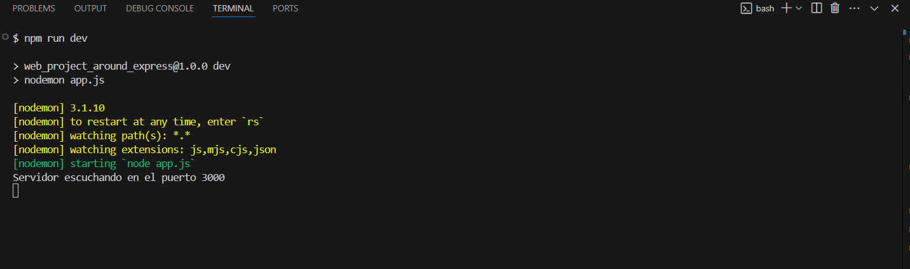
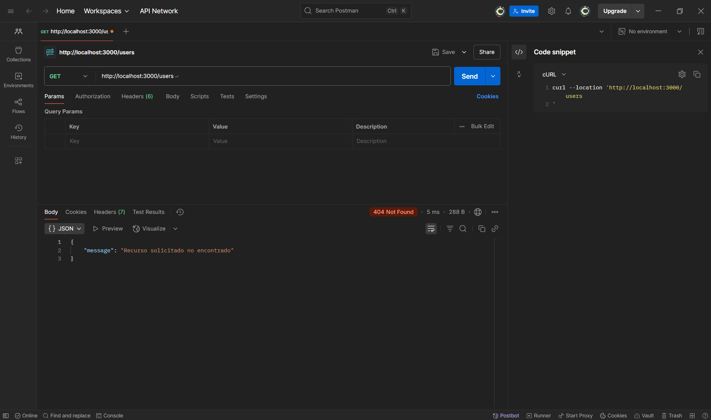
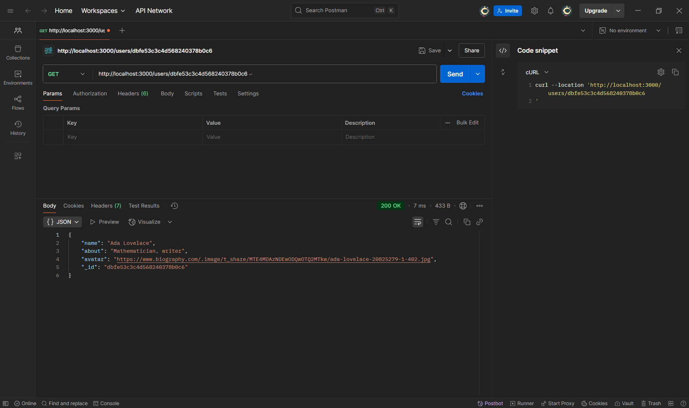
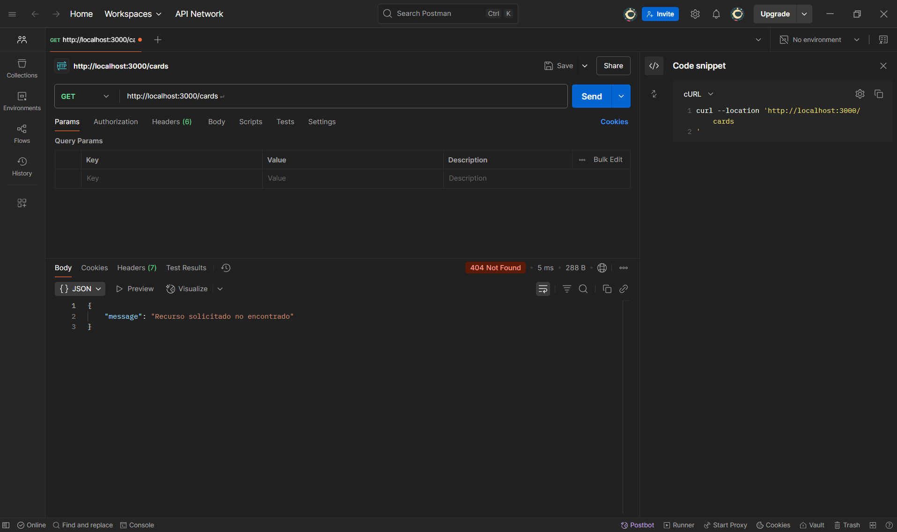
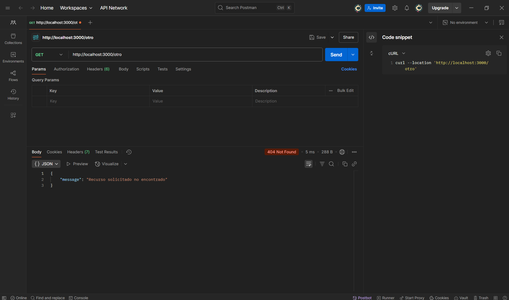
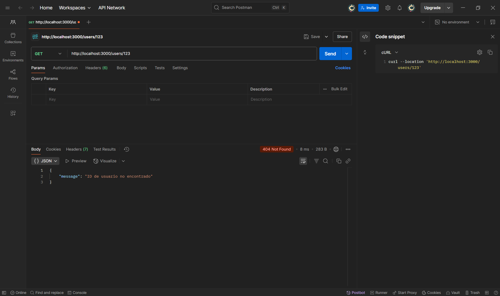

# Tripleten web_project_around_express

# Proyecto 15: Around the U.S. (Backend)

Este proyecto forma parte del curso de desarrollo web de TripleTen. Aquí se desarrolla la primera versión del **servidor backend** para el proyecto "Alrededor de los EE. UU.", el cual responde con datos desde archivos locales JSON simulando una API REST.

## Funcionalidad

- Proporciona rutas GET para obtener datos de usuarios y tarjetas.
- Implementa manejo de errores con respuestas adecuadas.
- Usa `fs` para leer archivos locales y `path` para asegurar rutas correctas.
- Maneja solicitudes a rutas inexistentes con una respuesta 404.

## Estructura del proyecto

web_project_around_express/
├── data/
│ ├── cards.json
│ └── users.json
├── routes/
│ ├── index.js
│ ├── users.js
│ └── cards.js
├── .editorconfig
├── .eslintrc
├── .gitignore
├── app.js
├── package.json
├── README.md

## 🔧 Tecnologías utilizadas

- Node.js
- Express.js
- Módulo `fs` y `path`
- ESLint con configuración `airbnb-base`
- EditorConfig

## Evidencias visuales del Proyecto 15

### Inicio del servidor

El servidor se ejecuta correctamente con hot reload en el puerto 3000.

---

### Pruebas de rutas con Postman

#### 1. `GET /users` — Lista completa de usuarios

#### 2. `GET /users/:id` — Usuario por ID

#### 3. `GET /cards` — Lista de tarjetas

#### 4. Ruta no encontrada — `/no-existe`

#### 5. ID de usuario inválido — `/users/id-invalido`

## Cómo iniciar el servidor

1. Clona el repositorio:
   git@github.com:CaroBedoya/web_project_around_express.git

2. Instala las dependencias:
   npm install

3. Inicia el servidor con hot reload:
   npm run dev

El servidor estará disponible en:  
[`http://localhost:3000`](http://localhost:3000)
